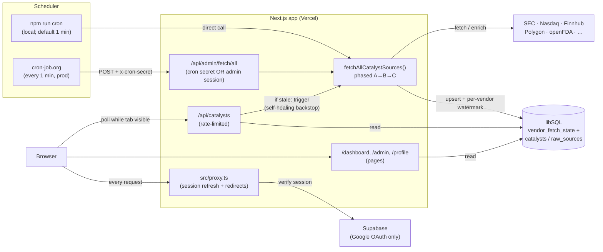

# Architecture

## TL;DR

Catalyst Intel is a **Next.js app on Vercel** that ingests market-moving catalysts
from multiple vendors, stores them in **libSQL** (SQLite locally / **Turso** in
prod), and serves a live-polling desk UI. Auth is **Supabase Google OAuth**.
There is no separate backend — ingestion, API, and UI live in one app.
**Production ETL is scheduled by [cron-job.org](https://cron-job.org)** (every
**1 minute**), which POSTs `/api/admin/fetch/all` with `x-cron-secret`.

## Diagram

## The pieces

| Piece                       | What                                                                     | Why                                                                                                                                     |
| --------------------------- | ------------------------------------------------------------------------ | --------------------------------------------------------------------------------------------------------------------------------------- |
| **Next.js app**             | One app: pages, API routes, ingestion job                                | No separate backend to deploy/monitor — Vercel hosts everything.                                                                        |
| **Keyless vendors**         | SEC EDGAR (8-K + Form 4…), Nasdaq halts RSS, openFDA, ClinicalTrials.gov | Only `SEC_EDGAR_USER_AGENT` required; others need no keys. Soft-fail keyed vendors (Finnhub/Polygon).                                   |
| `fetchAllCatalystSources()` | Multi-source orchestrator (phased parallel A→B→C; see FETCH-ORDER.md)    | Admin `/api/admin/fetch/all`, **cron-job.org** (prod), local `npm run cron`.                                                            |
| **Scheduler (prod)**        | **cron-job.org** → `POST /api/admin/fetch/all` every **1 minute**        | Sole production ETL scheduler on Vercel Hobby. Job title example: `catalyst-intel prod ETL`.                                            |
| **Scheduler (local)**       | `npm run cron` (`CRON_INTERVAL_MINUTES`, default **1**)                  | Same orchestrator as prod while developing.                                                                                             |
| **Per-vendor watermark**    | `vendor_fetch_state.last_fetched_at`                                     | Advances only on success. After Polygon **429**, cursor is held so the next tick widens `published_utc.gte` / enrich batch (no misses). |
| **Self-healing backstop**   | `GET /api/catalysts` triggers a refetch if data is stale                 | Covers scheduler gaps whenever there's real traffic.                                                                                    |
| **Data retention**          | Catalysts older than 30 days (by filing date) purged after every fetch   | Keeps the DB bounded to what a "live" feed needs — see [DEPLOYMENT.md](DEPLOYMENT.md).                                                  |
| **libSQL / Turso**          | All app data (companies, catalysts, raw sources, users)                  | SQLite locally (zero setup), hosted Turso in prod (same driver/schema, Vercel has no durable disk).                                     |
| **Supabase**                | Auth only (Google OAuth)                                                 | No passwords stored; Supabase's own Postgres is unused.                                                                                 |
| `src/proxy.ts`              | Refreshes session cookie, optimistic redirect                            | Cheap edge check; real authorization still happens per-route.                                                                           |
| **Dashboard**               | Polls `/api/catalysts` while the tab is visible                          | "Live feed" feel without websockets.                                                                                                    |

## Data flow, step by step

1. A **scheduler** (**cron-job.org** in prod every 1 min, `npm run cron` locally) calls
   `POST /api/admin/fetch/all` (legacy `…/sec-edgar` still works for SEC-only).
2. That route authenticates the caller (cron secret, or an allowlisted admin session) and runs
   `fetchAllCatalystSources()`.
3. Each source normalizes into catalysts, **dedupes by `raw_sources.external_id`**, updates
   **`vendor_fetch_state`** (per-source `last_fetched_at`), then a single 30-day retention pass
   runs — safe to re-run anytime.
4. The **dashboard** (signed-in users only) polls `GET /api/catalysts` on an interval while the
   tab is visible, and renders whatever is in the database (Source column from `raw_sources.provider`).
5. **Auth** is Supabase Google OAuth end-to-end; `src/proxy.ts` keeps the session cookie fresh on
   every request, and admin access is a server-side email allowlist check, not a special token.

## Where to go deeper

- [README.md](README.md) — local setup, env vars, scripts.
- [FETCH-ORDER.md](FETCH-ORDER.md) — phases, Polygon 429 catch-up, per-vendor watermarks.
- [DEPLOYMENT.md](DEPLOYMENT.md) — environments, CI/CD, secrets, and scheduler trade-offs.
