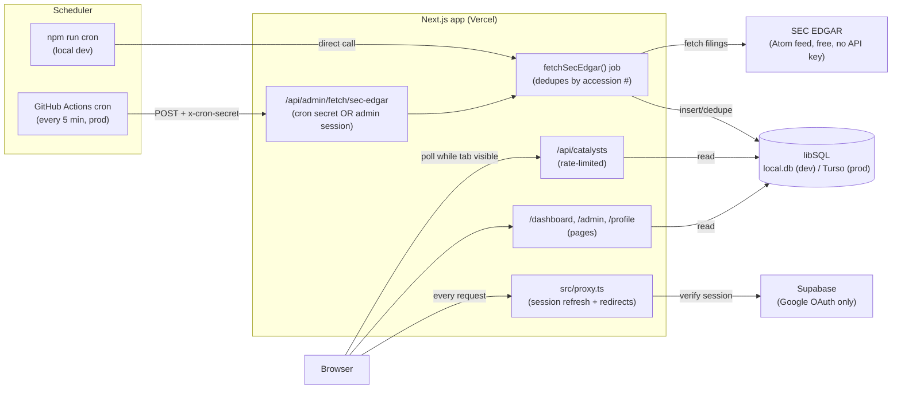

# Architecture

## TL;DR

Catalyst Intel is a **Next.js app on Vercel** that pulls market-moving filings from **SEC EDGAR**
on a schedule, stores them in a **libSQL database** (SQLite locally, hosted **Turso** in
production), and shows them in a **live-polling dashboard** gated by **Supabase Google auth**.
There is no separate backend service — ingestion, API, and UI all live in one Next.js app;
**GitHub Actions** is just an external clock that pings it.

## Diagram

## The pieces

| Piece                     | What                                                    | Why                                                                                                           |
| ------------------------- | ------------------------------------------------------- | ------------------------------------------------------------------------------------------------------------- |
| **Next.js app**           | One app: pages, API routes, ingestion job               | No separate backend to deploy/monitor — Vercel hosts everything.                                              |
| **SEC EDGAR**             | Free, keyless Atom feed of 8-K filings                  | First data vendor; more (FDA, ClinicalTrials.gov) planned later.                                              |
| **`fetchSecEdgar()` job** | Fetches, resolves tickers, dedupes, writes              | Single source of truth for ingestion, called 3 ways (below).                                                  |
| **Scheduler**             | GitHub Actions cron (prod) / `npm run cron` (local)     | Free scheduler that just calls the API — see [DEPLOYMENT.md](DEPLOYMENT.md) for why it's not Vercel Cron yet. |
| **libSQL / Turso**        | All app data (companies, catalysts, raw sources, users) | SQLite locally (zero setup), hosted Turso in prod (same driver/schema, Vercel has no durable disk).           |
| **Supabase**              | Auth only (Google OAuth)                                | No passwords stored; Supabase's own Postgres is unused.                                                       |
| **`src/proxy.ts`**        | Refreshes session cookie, optimistic redirect           | Cheap edge check; real authorization still happens per-route.                                                 |
| **Dashboard**             | Polls `/api/catalysts` while the tab is visible         | "Live feed" feel without websockets.                                                                          |

## Data flow, step by step

1. A **scheduler** (GitHub Actions in prod, `npm run cron` locally) calls
   `POST /api/admin/fetch/sec-edgar`.
2. That route authenticates the caller (cron secret, or an allowlisted admin session) and runs
   **`fetchSecEdgar()`**.
3. The job pulls the SEC EDGAR feed, resolves CIKs to tickers, and **dedupes by SEC accession
   number** before writing to the database — safe to re-run anytime.
4. The **dashboard** (signed-in users only) polls `GET /api/catalysts` on an interval while the
   tab is visible, and renders whatever is in the database.
5. **Auth** is Supabase Google OAuth end-to-end; `src/proxy.ts` keeps the session cookie fresh on
   every request, and admin access is a server-side email allowlist check, not a special token.

## Where to go deeper

- [README.md](README.md) — local setup, env vars, scripts.
- [DEPLOYMENT.md](DEPLOYMENT.md) — environments, CI/CD, secrets, and the GitHub Actions vs. Vercel
  Cron trade-off.
