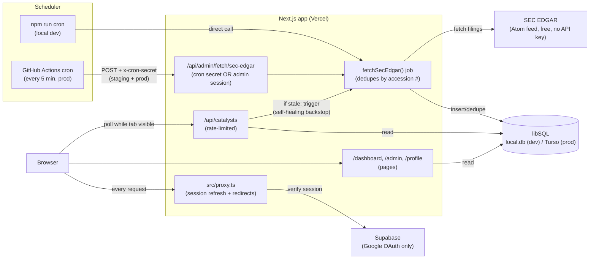

# Architecture

## TL;DR

Catalyst Intel is ted by **Supabase Google auth**.
There is no separate backend service — ingestion, API,a **Next.js app on Vercel** that pulls market-moving filings from **SEC EDGAR**
on a schedule, stores them in a **libSQL database** (SQLite locally, hosted **Turso** in
production), and shows them in a **live-polling dashboard** ga and UI all live in one Next.js app;
**GitHub Actions** is just an external clock that pings it.

## Diagram

## The pieces

| Piece                       | What                                                                     | Why                                                                                                                                      |
| --------------------------- | ------------------------------------------------------------------------ | ---------------------------------------------------------------------------------------------------------------------------------------- |
| **Next.js app**             | One app: pages, API routes, ingestion job                                | No separate backend to deploy/monitor — Vercel hosts everything.                                                                         |
| **Keyless vendors**         | SEC EDGAR (8-K + Form 4…), Nasdaq halts RSS, openFDA, ClinicalTrials.gov | Only `SEC_EDGAR_USER_AGENT` required; others need no keys. Soft-fail keyed vendors (Finnhub/Polygon).                                    |
| `fetchAllCatalystSources()` | Multi-source orchestrator (phased parallel A→B→C; see FETCH-ORDER.md)    | Admin `/api/admin/fetch/all`, GHA cron, local `npm run cron`.                                                                            |
| **Scheduler**               | GitHub Actions cron (staging + prod) / `npm run cron` (local)            | Free scheduler that just calls the API, but drifts far past its 5-min config (~75min avg observed) — see [DEPLOYMENT.md](DEPLOYMENT.md). |
| **Self-healing backstop**   | `GET /api/catalysts` triggers a refetch if data is stale                 | Covers for the scheduler's unreliable timing whenever there's real traffic.                                                              |
| **Data retention**          | Catalysts older than 30 days (by filing date) purged after every fetch   | Keeps the DB bounded to what a "live" feed needs — see [DEPLOYMENT.md](DEPLOYMENT.md).                                                   |
| **libSQL / Turso**          | All app data (companies, catalysts, raw sources, users)                  | SQLite locally (zero setup), hosted Turso in prod (same driver/schema, Vercel has no durable disk).                                      |
| **Supabase**                | Auth only (Google OAuth)                                                 | No passwords stored; Supabase's own Postgres is unused.                                                                                  |
| `src/proxy.ts`              | Refreshes session cookie, optimistic redirect                            | Cheap edge check; real authorization still happens per-route.                                                                            |
| **Dashboard**               | Polls `/api/catalysts` while the tab is visible                          | "Live feed" feel without websockets.                                                                                                     |

## Data flow, step by step

1. A **scheduler** (GitHub Actions in prod, `npm run cron` locally) calls
   `POST /api/admin/fetch/all` (legacy `…/sec-edgar` still works for SEC-only).
2. That route authenticates the caller (cron secret, or an allowlisted admin session) and runs
   `fetchAllCatalystSources()`.
3. Each source normalizes into catalysts, **dedupes by `raw_sources.external_id`**, then a single
   30-day retention pass runs — safe to re-run anytime.
4. The **dashboard** (signed-in users only) polls `GET /api/catalysts` on an interval while the
   tab is visible, and renders whatever is in the database (Source column from `raw_sources.provider`).
5. **Auth** is Supabase Google OAuth end-to-end; `src/proxy.ts` keeps the session cookie fresh on
   every request, and admin access is a server-side email allowlist check, not a special token.

## Where to go deeper

- [README.md](README.md) — local setup, env vars, scripts.
- [DEPLOYMENT.md](DEPLOYMENT.md) — environments, CI/CD, secrets, and the GitHub Actions vs. Vercel
  Cron trade-off.
