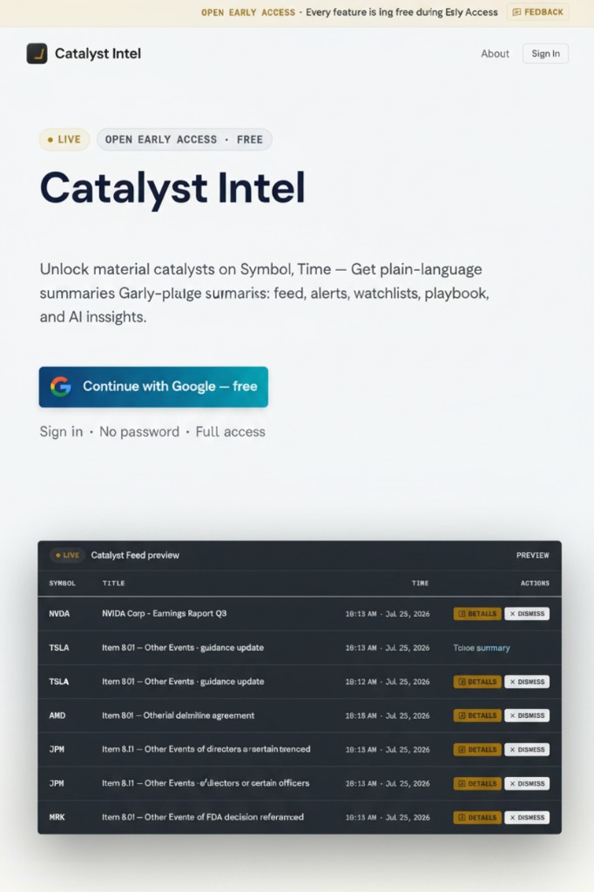
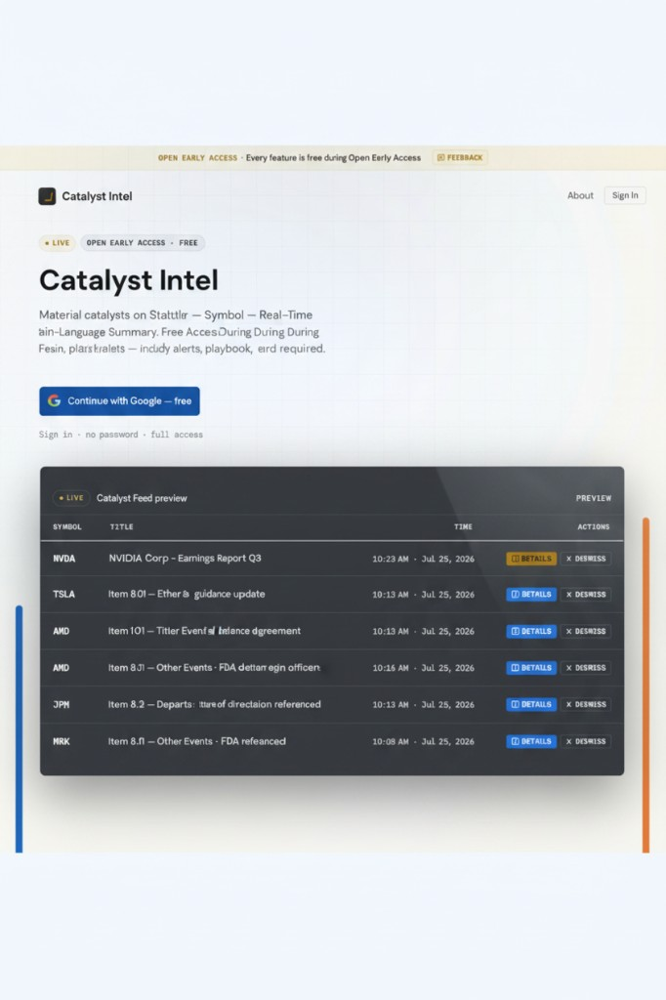
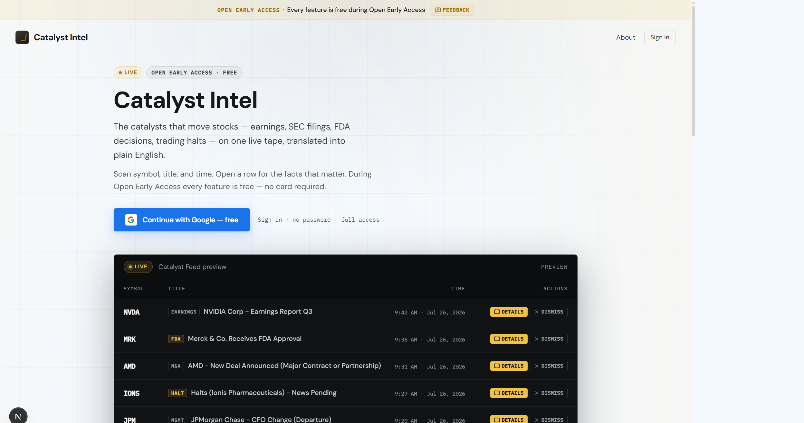
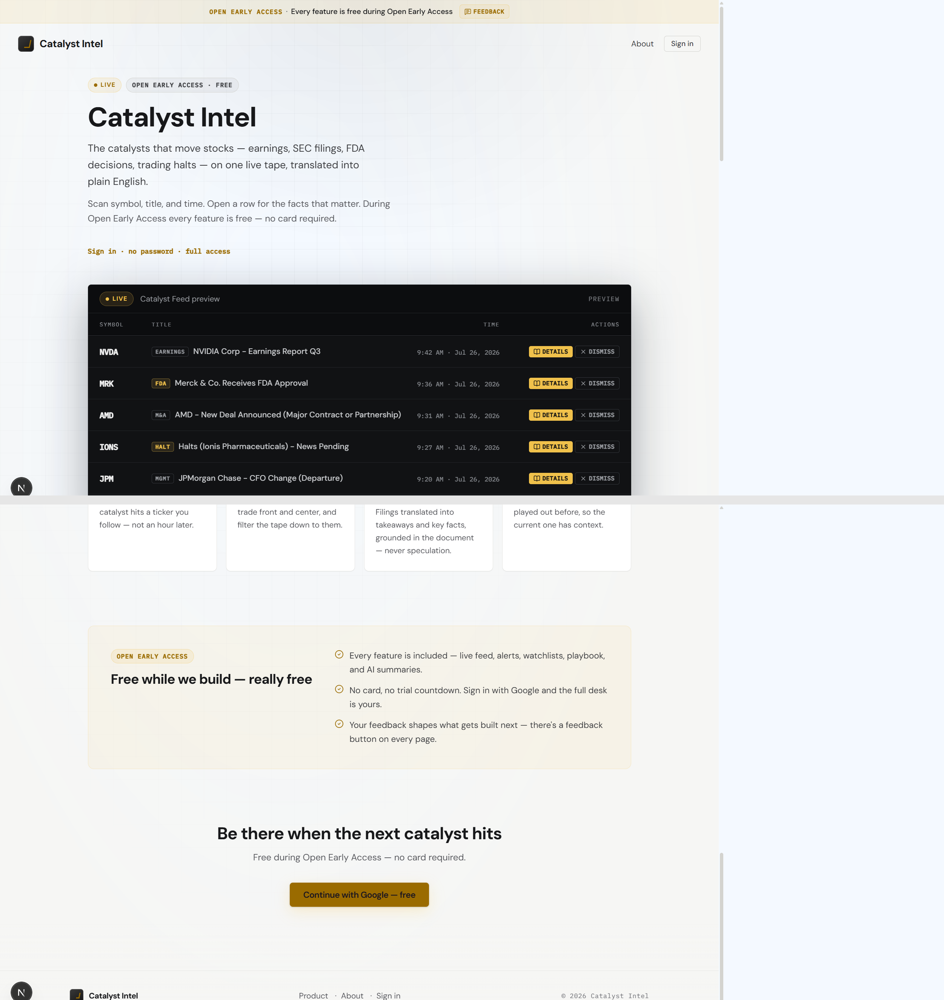

# UX/UI Design Image Reference

All images here are design references. Canonical copies live under `docs/design/`.

_Dark trading-desk / multi-panel feed UI reference_

_Prelogin / marketing landing — brand, hero, CTA, and feed preview blotter_

_Target prelogin redesign — preserve existing top (banner, nav, hero, feed preview); add social proof, features, testimonial, final CTA, and footer_

_Keep top / not-mention sections same — dark feed preview; teal-blue Google CTA_

_Keep top / not-mention sections same — dark feed preview; blue Google CTA_

_Implemented redesign (desktop 1440px): light hero, Google-blue CTA, dark terminal feed preview with real category chips; honest sections below (workflow, coverage, capabilities, early-access panel)_

_Follow-up fix (desktop 1440px, top + bottom composite): removed the duplicate blue "Continue with Google" CTAs near the top (hero + mobile sticky bar) — hero now ends with a plain text sign-in link. The single remaining CTA lives in the final section near the footer, restyled from Google-brand blue to the desk's gold/amber accent (`--desk-live`), matching the LIVE badges, DETAILS buttons, and the About page's CTA._
