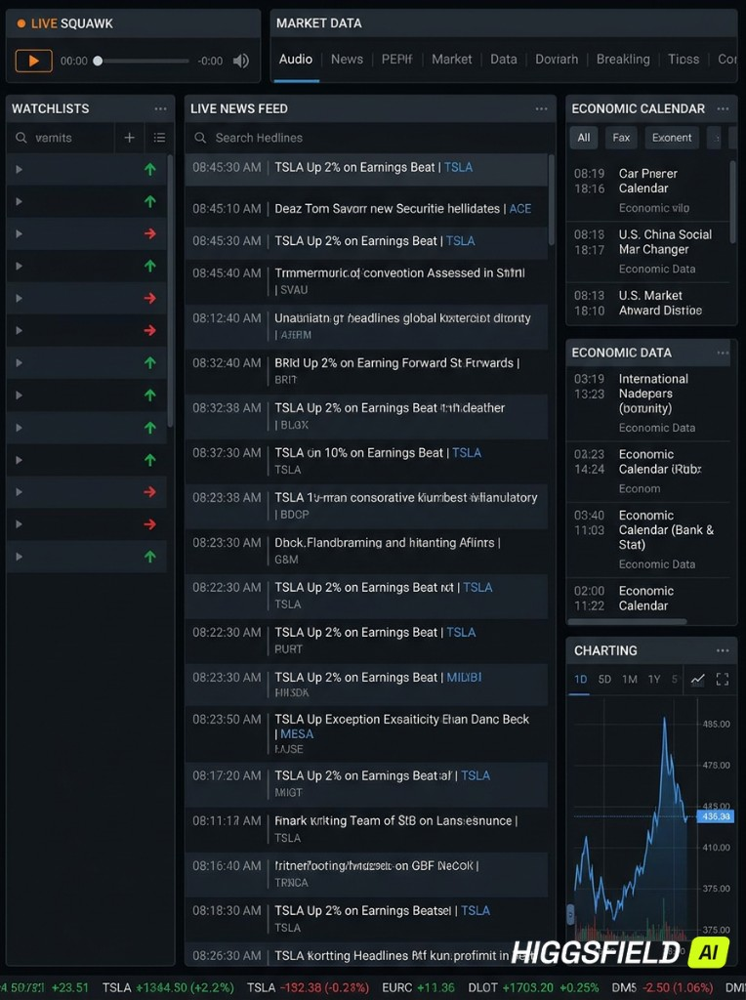
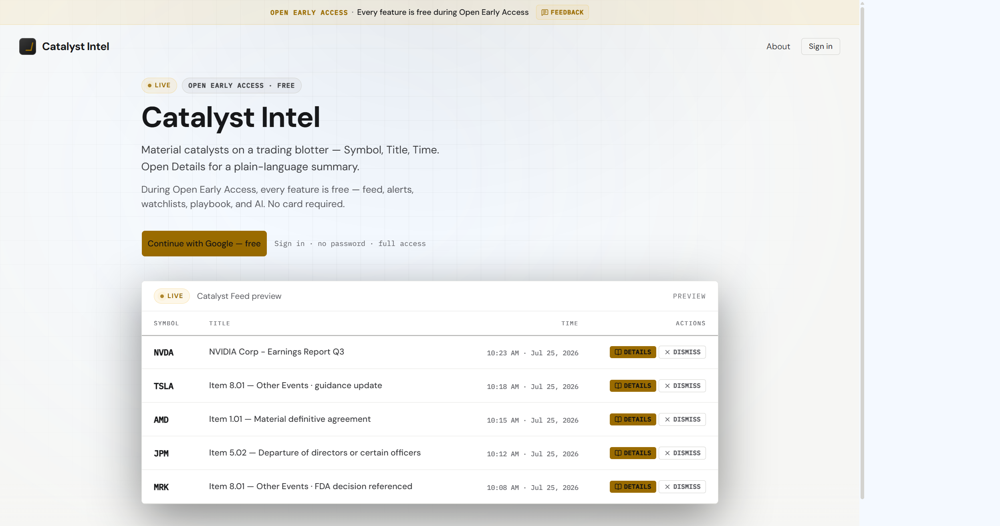
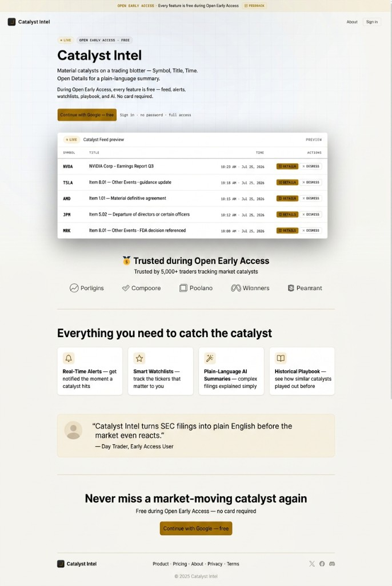

# UX/UI Design Image Reference

All images here are design references. Canonical copies live under `docs/design/`.

_Dark trading-desk / multi-panel feed UI reference_

_Prelogin / marketing landing — brand, hero, CTA, and feed preview blotter_

_Target prelogin redesign — preserve existing top (banner, nav, hero, feed preview); add social proof, features, testimonial, final CTA, and footer_
