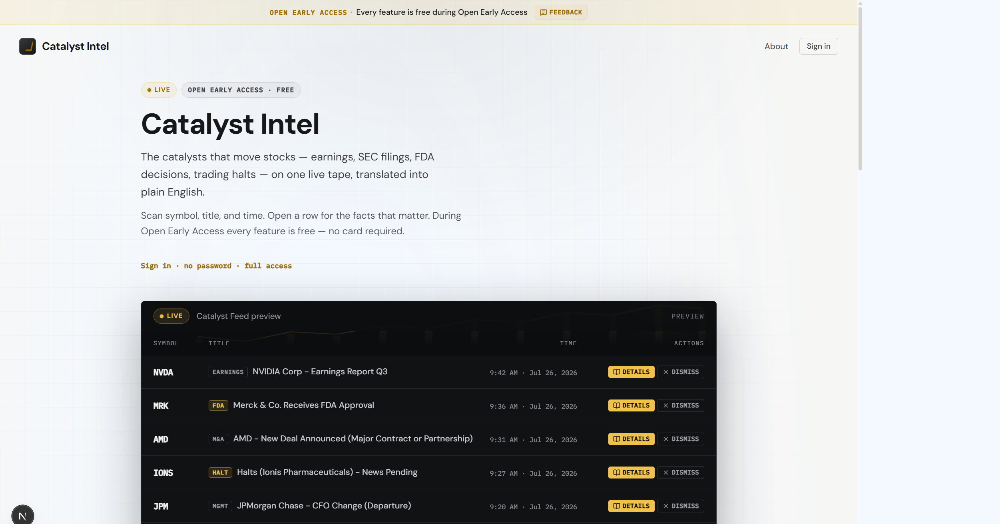

# UX/UI Design Image Reference

All images here are design references. Canonical copies live under `docs/design/`.

_Dark trading-desk / multi-panel feed UI reference_

_Prelogin / marketing landing — brand, hero, CTA, and feed preview blotter_

_Target prelogin redesign — preserve existing top (banner, nav, hero, feed preview); add social proof, features, testimonial, final CTA, and footer_

_Keep top / not-mention sections same — dark feed preview; teal-blue Google CTA_

_Keep top / not-mention sections same — dark feed preview; blue Google CTA_

_Implemented redesign (desktop 1440px): light hero, Google-blue CTA, dark terminal feed preview with real category chips; honest sections below (workflow, coverage, capabilities, early-access panel)_

_Latest state (desktop 1440px): single bottom CTA in gold/amber accent (`--desk-live`), duplicate top "Continue with Google" CTAs removed (hero ends with a plain text sign-in link — see prior -02 fix, now superseded by this screenshot). Added: a faint animated candlestick/trendline chart illustration behind the "Catalyst Feed preview" header, in the same gold accent, fading out before the row content — market-chart flavor without a new color or touching the tape-row content hierarchy._
