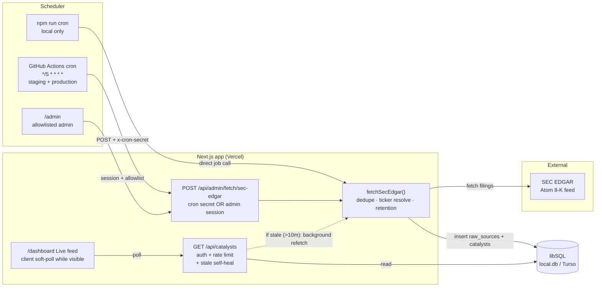
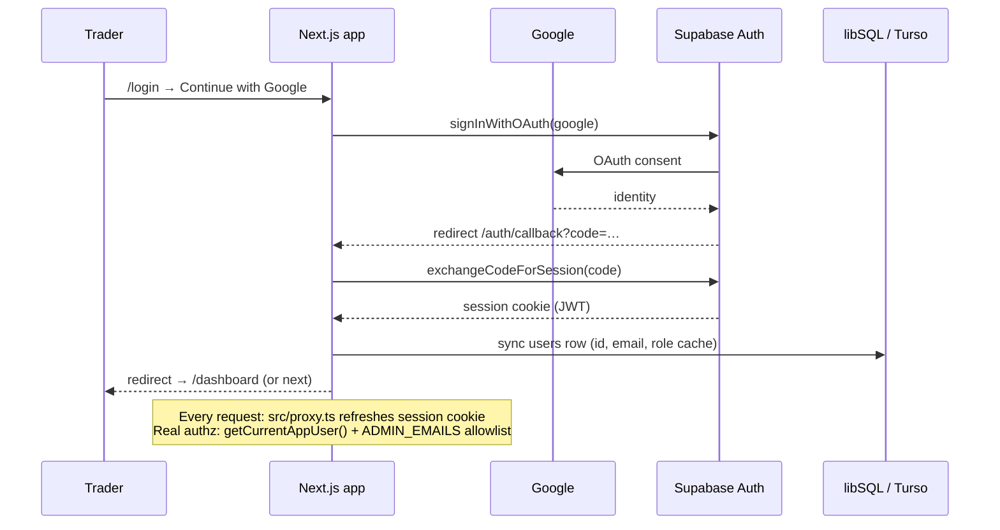
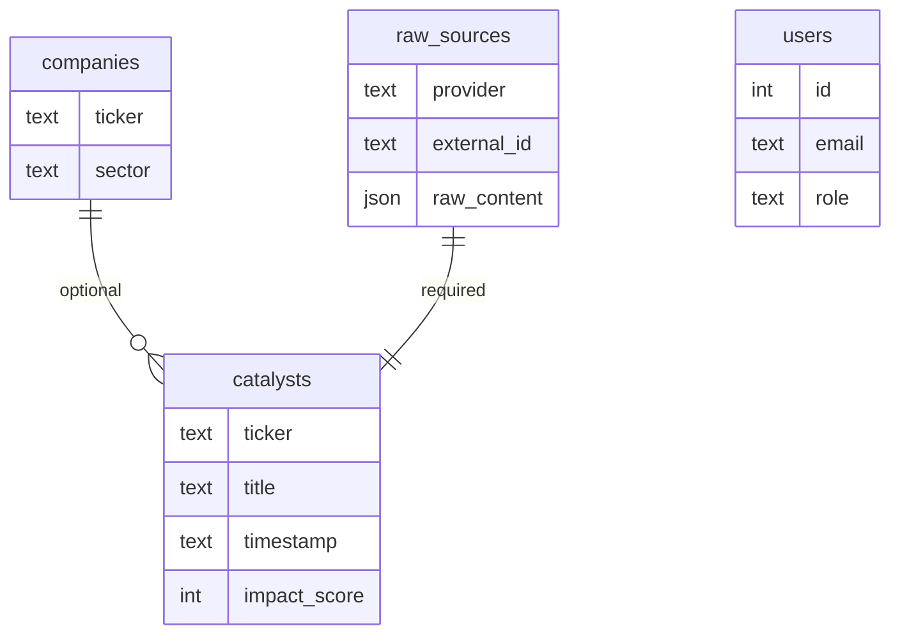
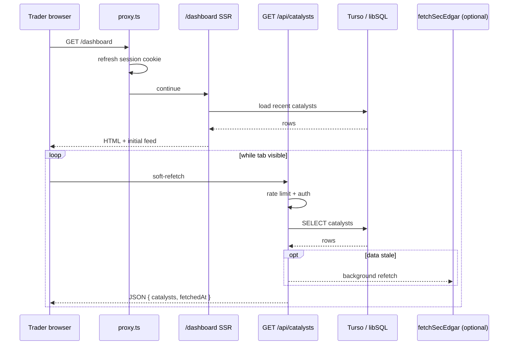

# Catalyst Intel — Architecture Flow

High-level map of how Catalyst Intel works today: one Next.js app that ingests SEC filings, stores them in libSQL/Turso, and serves a signed-in Live feed. No secrets in this doc.

---

## 1. High-level purpose

**Catalyst Intel** is a market-catalyst intelligence app for active traders. In this phase it:

- Pulls **SEC EDGAR 8-K** filings on a schedule (and on demand)
- Stores events in a **libSQL** database (local SQLite file / hosted **Turso**)
- Shows them in a **Live feed** dashboard behind **Google sign-in** (via **Supabase Auth**)
- Runs as a **single Next.js app on Vercel** — ingestion job, APIs, and UI share one deploy

There is no separate backend service. **GitHub Actions** is only an external clock that POSTs into the app. AI scoring and extra vendors (FDA, ClinicalTrials.gov) are planned later and not wired yet.

---

## 2. Mermaid diagrams

### 2a. Ingest flow (external → cron → API → DB → Live feed UI)



**Ingestion triggers (same job, four callers):**

| Caller                         | Auth                               | Where                           |
| ------------------------------ | ---------------------------------- | ------------------------------- |
| GitHub Actions workflow        | `x-cron-secret`                    | Staging + production (matrix)   |
| `/admin` “Fetch SEC EDGAR now” | Supabase session + email allowlist | Any env                         |
| `npm run cron`                 | Local process (no HTTP)            | Local only                      |
| `GET /api/catalysts` backstop  | Authenticated reader; non-blocking | When latest raw source is stale |

> Cron is configured every 5 minutes but is **best-effort** in practice (often closer to hourly). The Live-feed read path’s self-healing refetch keeps data fresh when users are active.

### 2b. Auth flow (Google → Supabase JWT → app)



- **Google is the only sign-in method** — no passwords stored in the app.
- Supabase is used for **Auth only** (its Postgres is unused for app data).
- Admin access is **email allowlist** (`ADMIN_EMAILS` or built-in defaults), checked from the verified session email — not a separate admin token. `users.role` is a cache only.

---

## 3. Environments

| Environment    | Git branch                       | Hosting           | Database                 | Deploy trigger                  |
| -------------- | -------------------------------- | ----------------- | ------------------------ | ------------------------------- |
| **Local**      | Feature branches on your machine | `npm run dev`     | SQLite `file:./local.db` | Manual                          |
| **Staging**    | `dev`                            | Vercel Preview    | Turso (staging)          | Push / merge to `dev`           |
| **Production** | `main`                           | Vercel Production | Turso (production)       | Explicit promote `dev` → `main` |

**Branching rules (summary):**

- Feature work → cut from `dev` → PR **into `dev`** (never commit straight to `dev` / `main`)
- Promote to production only on explicit request
- **CI** (`.github/workflows/ci.yml`): format, lint, unit tests, build on push to `dev`/`main` and PRs into `dev`
- **CD**: Vercel deploys **only** `dev` and `main` (`vercel.json`); feature branches do not deploy
- **ETL cron**: `.github/workflows/fetch-sec-edgar-cron.yml` hits staging + production URLs with `x-cron-secret` (skips quietly if secrets unset)

Migrations run as part of `npm run build` (`drizzle-kit migrate && next build`), so staging/prod schema updates land with each deploy.

---

## 4. Key components

| Component            | Path / surface                               | Role                                                                                                          |
| -------------------- | -------------------------------------------- | ------------------------------------------------------------------------------------------------------------- |
| **GHA cron**         | `.github/workflows/fetch-sec-edgar-cron.yml` | Scheduled POST to fetch API (staging + prod matrix); workflow_dispatch for manual runs                        |
| **Admin fetch API**  | `POST /api/admin/fetch/sec-edgar`            | Runs `fetchSecEdgar()`; accepts cron secret **or** allowlisted admin session                                  |
| **Fetch job**        | `src/lib/jobs/fetch-sec-edgar.ts`            | Pull SEC Atom feed → resolve tickers → dedupe by accession → write DB → 30-day retention purge                |
| **Catalysts API**    | `GET /api/catalysts`                         | Authenticated Live-feed list; rate-limited; may trigger background refetch if data stale                      |
| **Rate limit**       | `src/lib/http/rate-limit.ts`                 | In-memory per-IP: **90/min** feed reads, **6/min** admin session writes; **cron secret bypasses** admin limit |
| **Allowlist admins** | `src/lib/auth/admin.ts` + `ADMIN_EMAILS`     | Server-side gate for `/admin` and session-based fetch; JWT email is source of truth                           |
| **Proxy**            | `src/proxy.ts`                               | Session cookie refresh + optimistic redirect (not the security boundary)                                      |
| **Live feed UI**     | `/dashboard` + `LiveCatalystFeed`            | SSR first paint from DB; client soft-polls API while tab visible/focused                                      |
| **Auth**             | Supabase Google OAuth                        | `/login` → Google → `/auth/callback` → session → synced `users` row                                           |
| **DB**               | Drizzle + libSQL                             | Local file or Turso via `LIBSQL_URL` / `LIBSQL_AUTH_TOKEN`                                                    |

---

## 5. Data model sketch

App data lives in **libSQL** (not Supabase Postgres):

```text
users
  id · supabase_user_id · email · display_name · role(cache) · subscription · created_at

companies
  id · name · ticker? · sector? · market_cap? · created_at
  (reference data; not purged by retention)

raw_sources
  id · provider · external_id(unique) · url? · raw_content(json) · fetched_at
  (vendor payload as received; dedupe key e.g. SEC accession)

catalysts
  id · company_id? · ticker? · company_name? · type · title
  · headline? · event_category? · item_codes(json)?
  · timestamp · raw_source_id → raw_sources
  · summary? · impact_score?   ← AI fields reserved, null for now
  · created_at
```

**Relationships (sketch):**



Retention: catalysts older than **30 days** (by filing timestamp) are purged after each successful fetch; orphaned `raw_sources` go with them. `companies` are kept.

---

## 6. Request path — trader viewing Live feed

End-to-end path for a signed-in trader on `/dashboard`:

1. **Browser** hits `/dashboard` (session cookie present).
2. **`src/proxy.ts`** refreshes the Supabase session cookie (edge/cheap check).
3. **Server page** (`dashboard/page.tsx`) calls `getCurrentAppUser()`:
   - Verifies Supabase JWT / user
   - Syncs / loads local `users` row
   - Redirects to `/login` if unauthenticated
4. **SSR read**: query latest catalysts (+ `raw_sources.url`) from Turso/libSQL → render `LiveCatalystFeed` with initial rows.
5. **Client soft-poll** (while tab visible):
   - Focused ≈ every **20s**; blurred-but-visible ≈ **90s**; hidden = paused
   - `GET /api/catalysts?limit=50` with credentials
6. **Catalysts API**:
   - Per-IP rate limit (90/min)
   - Requires authenticated session
   - Returns catalyst JSON ordered by filing timestamp
   - If newest `raw_sources.fetched_at` is stale (> ~10 min, with cooldown), kicks off **non-blocking** `fetchSecEdgar()` in the background
7. **UI** merges new rows (flash highlight), applies client filters (ticker, category, time window), opens detail drawer on row click.



---

## 7. Live feed columns — presentation layer

**Data layer** already exposes richer fields (`ticker`, `companyName`, `headline`/`title`, `eventCategory`, `timestamp`, `sourceUrl`, optional `companies.sector`, etc.).

**UI today (shipped):** Age · Ticker · Company · Event · Time  
(relative age + clock time; category badge on the event line)

**Planned UX columns (presentation only — no ingest/API contract change required):**

| Planned column  | Intent                    | Likely source field(s)                            |
| --------------- | ------------------------- | ------------------------------------------------- |
| **Source**      | Where the event came from | `raw_sources.provider` / display label (e.g. SEC) |
| **Sector**      | Company sector context    | `companies.sector` (when populated)               |
| **Title**       | Trader-facing headline    | `headline` / `title`                              |
| **time · date** | When filed / occurred     | `catalysts.timestamp` formatted as time · date    |

Treat Source / Sector / Title / time·date as a **feed layout concern**: remap or restyle existing API/DB fields in the Live feed component. Do not invent a parallel storage model for these columns.

---

## Quick mental model

```text
SEC EDGAR ──► fetchSecEdgar() ──► Turso/libSQL ──► /api/catalysts ──► Live feed UI
                 ▲                      ▲
                 │                      │
         GHA cron /admin / local cron   Supabase Google session
                 │
         (+ self-heal on stale read)
```

One app. One job. Auth at the edge of pages/APIs. Cron is a pinger, not a data plane.
