# Engineer UX / Feature Roadmap — Visual

**Companion to:** [`ENGINEER-UX-FEATURE-ROADMAP.md`](./ENGINEER-UX-FEATURE-ROADMAP.md) (full prose + tables)  
**Audience:** Engineers who want the same substance in diagrams, swimlanes, and checklists  
**Status:** Visual synthesis of existing research (Jul 2026) + **Clear news catalysts dashboard** acceptance (product JTBD Jul 2026) — not a new product invent  
**Sources:** filenames cited inline; full index in §8 of the prose roadmap

---

## Map of this doc

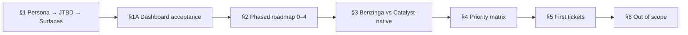

---

## 1. Persona → JTBD → product surfaces

### Beachhead personas (build for these first)

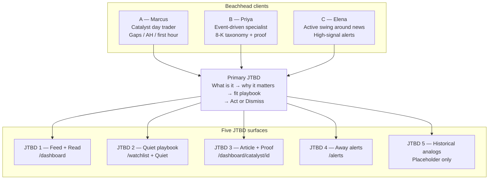

**Sources:** `Catalyst-Intel-Client-Target-Guideline.md`, `Catalyst-Intel-Client-Summary.md`, `Catalyst-Intel-JTBD-UX-UI.md`, `ACCEPTANCE-JTBD.md`.

### Job chain (Detect → Learn)

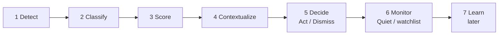

### Positioning wedge (protect this)

```text
┌─────────────────────────────────────────────────────────────┐
│  Decision / triage for EVENT traders                        │
│  Primary source → taxonomy → materiality → Act/Dismiss      │
│  then attach price / volume / history                       │
├──────────────────────────┬──────────────────────────────────┤
│  DO claim                │  DO NOT claim                    │
│  • Clearer decisions     │  • Faster than Benzinga wire     │
│  • Source proof          │  • Bloomberg killer              │
│  • Less noise            │  • Guaranteed edge               │
│                          │  • “Verified AI” without source  │
└──────────────────────────┴──────────────────────────────────┘
```

**Non-targets:** passive research terminals · options-flow · technical scanners · Bloomberg replacement · crypto-first.

**Sources:** `Catalyst-Intel-Client-Target-Guideline.md` §§1–5, `Catalyst-Intel-Client-Summary.md` §§1–4.

### IA priority (nav order)

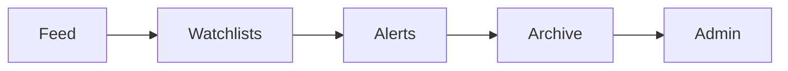

Archive / Search is still a gap vs research IA → Phase 2.  
**Source:** `Catalyst-Intel-Client-Architecture-and-Flow.md` §8.

---

## 1A. Clear news catalysts dashboard — acceptance (product JTBD Jul 2026)

**Audience:** Engineers shipping feed / taxonomy / marketing-page work  
**Companion build rules:** [`ENGINEER-UX-UI-IMPLEMENTATION-GUIDE.md`](./ENGINEER-UX-UI-IMPLEMENTATION-GUIDE.md) §4 (column grammar), [`ENGINEER-UX-UI-GUIDE-SIMPLE.md`](./ENGINEER-UX-UI-GUIDE-SIMPLE.md) §3  
**Sources:** product JTBD (Jul 2026), `Catalyst-Intel-Benzinga-Pro-Catalysts-Source-Map.md`, `Catalyst-Intel-Sources-and-Schema-Recommendation.md`, `taxonomy.ts`

### Goals (engineer contract)

1. **Taxonomy ↔ API correlation:** Every catalyst subject that the product exposes as a dashboard filter must map to a real ingest path (`raw_sources.provider` → `catalysts.eventCategory` / subcategory) and must surface in the authenticated feed UI. Do not ship filter chips that return empty forever because no provider is wired.
2. **Day-trader desk efficiency:** Optimize the authenticated `/dashboard` for fast triage (dense rows, honest timestamps, symbol-first drill-down). Keep marketing chrome off the post-login tape.

### Product decision — main blotter columns

| Prior grammar (shipped / older docs)       | **New grammar (decision)**                                                                   |
| ------------------------------------------ | -------------------------------------------------------------------------------------------- |
| **Title · Time · Event · Ticker · Action** | **Symbol · Title · Time** (+ keep **Action** toolbar: Read / Dismiss / Quiet) — Symbol first |

**Do this:**

- Lead with **Symbol** as the row index (mono ticker / `—`), then **Title → Time**.
- Remove the primary Event column. Remove source details from dashboard rows: no Source column; do not append provider names under the title; strip provider prefixes from titles when present (`stripSourceNames` / equivalent).
- Keep Event/category available as filter chips and inside Read / drawer meta — not as a primary blotter column.
- Update `live-catalyst-feed.tsx`, feed-display helpers, and both engineer UX guides in the same PR as the UI change.

**Mobile stack:** Symbol (index col) + Title, with **Time** under Title (Event no longer in the primary stack).

### A. Default dashboard rows — acceptance

- [x] Desktop columns render **Symbol | Title | Time** in that order.
- [x] Action controls remain reachable without overlapping Time/Symbol.
- [x] Rows do not show source provider name, wire label strip, or Source column.
- [x] Title prefers headline / filing title with source names stripped.
- [x] Time remains event occurrence in **ET** (`catalysts.timestamp`); never DB insert time.
- [x] Symbol is mono; empty ticker shows `—` and is not clickable.

### B. Earnings filter — alternate column schema

When the **Earnings** filter chip is active, replace the default blotter columns with:

| Column         | Content                                                                 |
| -------------- | ----------------------------------------------------------------------- |
| **Date**       | Earnings / report date (calendar or filing date — be explicit in UI)    |
| **Name**       | Company name                                                            |
| **Symbol**     | Ticker                                                                  |
| **Period**     | Fiscal quarter label only: **Q1 / Q2 / Q3 / Q4** (no free-text seasons) |
| **EPS**        | Reported EPS when known; otherwise `—`                                  |
| **Estimation** | Consensus / estimated EPS when known; otherwise `—`                     |

**API / schema implications:**

- Prefer Finnhub earnings calendar / surprise fields when keyed; enrich with SEC 8-K Item 2.02 rows classified as `earnings`.
- Persist or derive: `period` (quarter enum), `epsActual`, `epsEstimate` (map onto existing catalyst metadata / detail JSON — extend schema only if missing).
- Empty EPS/Estimation is allowed; do not invent numbers.

### C. Symbol click → drawer or split view

**Do this when the user clicks Symbol** on any row (default or earnings schema):

- [ ] Open existing drawer **or** split panel (`catalyst-detail-drawer.tsx` / `tape-split-panel.tsx`) — tape remains primary.
- [ ] Show a **price chart** for that symbol (reuse market quote / history paths; honest empty state if unkeyed).
- [ ] Show **updated quote details**: last price + %/absolute change across available timeframes (e.g. session, 1D, 5D, 1M — only what the API returns).
- [ ] Show **correlated news** for that symbol: catalysts/articles joined by ticker and/or keyword match on company/ticker; link into in-app Read.
- [ ] Do not navigate away from `/dashboard` for this interaction.

### D. Dashboard filter chips — UX order (decision)

Ship chips in this order (left → right). Rationale: default volume first, then highest day-trader cadence / materiality, then lower-frequency capital and macro/gov.

| #   | Chip label          | Maps to taxonomy / query                         |
| --- | ------------------- | ------------------------------------------------ |
| 1   | **All**             | No category filter (default)                     |
| 2   | **Earnings**        | `eventCategory = earnings` (+ earnings calendar) |
| 3   | **FDA Approvals**   | `regulatory` / FDA approval-class subcategories  |
| 4   | **Clinical Trials** | `clinical` / ClinicalTrials.gov updates          |
| 5   | **IPO**             | `capital` + IPO subcategories (`ipo*`)           |
| 6   | **Gov Reports**     | Gov / macro / SEC report-class events (see gaps) |

Do not randomize chip order. Additional taxonomy chips (halts, insider, analyst, …) may remain available behind All or secondary controls, but these six are the primary product filter set for this JTBD.

### E. Pre-login / marketing page (`src/app/page.tsx`)

**Do this:**

- [ ] Remove the fake / demo live tape preview and any “keys” / demo blotter from the pre-login page.
- [ ] Do **not** render an authenticated-style dashboard on the marketing surface.
- [ ] Lead with **real-time news catalysts** value: efficient triage, filtered catalyst topics, broad subject coverage.
- [ ] CTA → sign-in / sign-up only; no pretend live feed.

**Borrow patterns from trader-facing news sites (research notes — UX only, not a clone):**

| Site                               | Pattern to borrow                                                                                                                     | Do not copy                                                      |
| ---------------------------------- | ------------------------------------------------------------------------------------------------------------------------------------- | ---------------------------------------------------------------- |
| **Benzinga**                       | Hero promise of timely market-moving news; clear product CTA; social proof (desk / trader language) without embedding a full terminal | Loud multi-panel terminal chrome; Squawk; fake wire speed claims |
| **MarketWatch / Yahoo Finance**    | Plain value headline + “why sign in” clarity; topic coverage called out as categories                                                 | Dense magazine homepage as the product itself                    |
| **The Fly / Briefing-style desks** | Scarcity of chrome; “what moved / why” framing; professional tone                                                                     | Paywalled fake dashboards that look logged-in                    |

Concrete pre-login IA: **brand + one hero line + one supporting sentence + CTA group**. No demo tape, no filter chips, no keys strip.

### Filter → provider wiring (data / API gaps)

Engineers must treat each primary filter as an ingest + UI contract:

| Filter chip         | Primary providers / paths                                                                                                           | Status / gap                                                                                               |
| ------------------- | ----------------------------------------------------------------------------------------------------------------------------------- | ---------------------------------------------------------------------------------------------------------- |
| **All**             | Union of wired providers via `GET /api/catalysts`                                                                                   | Keep green; empty only when ingest is down                                                                 |
| **Earnings**        | SEC EDGAR 8-K Item **2.02**; **Finnhub** `calendar/earnings` (+ surprises when keyed); optional Polygon/Benzinga reaction headlines | Calendar EPS/estimate fields may be thin — schema gap for Period/EPS/Estimation UI                         |
| **FDA Approvals**   | **openFDA**; Finnhub FDA / AdCom calendar; regulatory 8-K                                                                           | Approvals ≠ AdCom calendar — label honestly; same-day desk chatter still paid wire                         |
| **Clinical Trials** | **ClinicalTrials.gov** API v2 (`clinicaltrials` provider)                                                                           | Registry updates, not PDUFA buzz                                                                           |
| **IPO**             | **Finnhub** `/calendar/ipo` → `capital` / `ipo*`                                                                                    | **Thin** today — deepen before promising parity                                                            |
| **Gov Reports**     | **SEC EDGAR** (filings / 8-K disclosure); macro schedule (CPI/NFP/FOMC); later **FRED** live prints                                 | Product label spans SEC + macro — define subcategory map before UI ships; do not pretend full gov firehose |

**Related market data for Symbol panel:** Polygon (or Finnhub) quotes / aggregates when keyed; soft-fail empty chart if unkeyed.

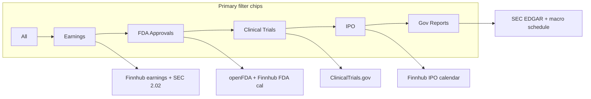

### Implementation tickets (imperative)

| ID  | Do this                                                                                                                             | Primary surfaces                                                          |
| --- | ----------------------------------------------------------------------------------------------------------------------------------- | ------------------------------------------------------------------------- |
| D1  | Change default blotter to **Symbol · Title · Time**; strip source from rows                                                         | `live-catalyst-feed.tsx`, `feed-display.ts`                               |
| D2  | When Earnings filter active, switch column schema to **Date · Name · Symbol · Period · EPS · Estimation**                           | feed + earnings metadata API                                              |
| D3  | On Symbol click, open drawer/split with chart, multi-timeframe quote, correlated ticker news                                        | `tape-split-panel.tsx`, `catalyst-detail-drawer.tsx`, `/api/market/quote` |
| D4  | Reorder primary filter chips to All → Earnings → FDA Approvals → Clinical Trials → IPO → Gov Reports; wire each to taxonomy queries | feed filters + `taxonomy.ts`                                              |
| D5  | Audit each chip against ingest; fill provider gaps or hide chip until data exists                                                   | jobs under `src/lib/jobs/`, Source Map                                    |
| D6  | Rebuild pre-login page: no demo tape; hero value prop + CTA only                                                                    | `src/app/page.tsx`, `pre-login-chrome`                                    |
| D7  | Keep engineer guides in sync (this file + Implementation + Simple guides)                                                           | `docs/research/ENGINEER-UX-*.md`                                          |

### Sync rule

If implementation changes column grammar or primary filter order, update **this section**, [`ENGINEER-UX-UI-IMPLEMENTATION-GUIDE.md`](./ENGINEER-UX-UI-IMPLEMENTATION-GUIDE.md) §4, and [`ENGINEER-UX-UI-GUIDE-SIMPLE.md`](./ENGINEER-UX-UI-GUIDE-SIMPLE.md) §3 in the **same PR**.

---

## 2. Phased roadmap (0 → 4)

Prefer hardening EDGAR + triage UX before buying Wire.  
**Sources:** Client Summary §10, Architecture §10, `ACCEPTANCE-JTBD.md`.

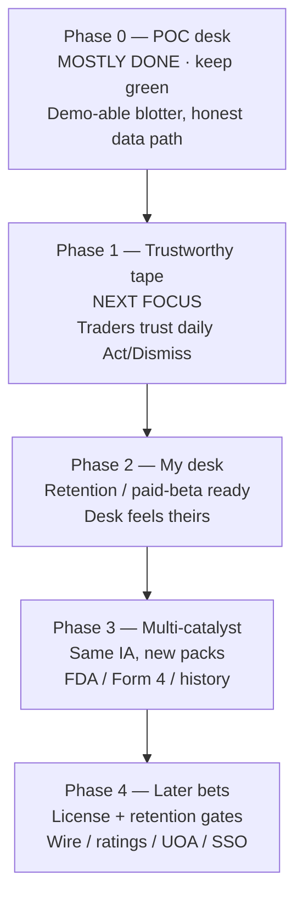

### Swimlane view (phase × workstream)

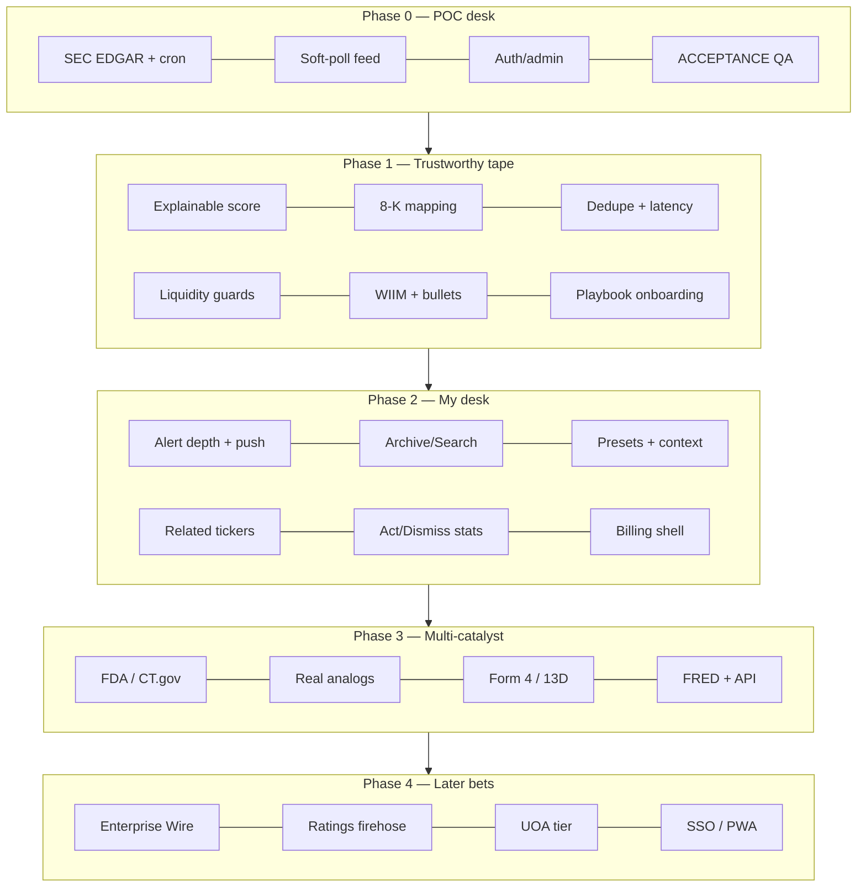

### Phase checklists (engineer-actionable)

#### Phase 0 — keep green

| Touchpoint                                      | Action                                   |
| ----------------------------------------------- | ---------------------------------------- |
| `/api/admin/fetch/sec-edgar`                    | Keep EDGAR 8-K path reliable             |
| `live-catalyst-feed.tsx` + `GET /api/catalysts` | Soft-poll + self-heal on stale           |
| Auth gate                                       | Allowlisted admin                        |
| `ACCEPTANCE-JTBD.md`                            | QA on `dev` Preview after every UX merge |

#### Phase 1 — next focus

| #   | Work                                              | Why / source                                         |
| --- | ------------------------------------------------- | ---------------------------------------------------- |
| 1.1 | “Why this score?” in drawer + Read                | Client Target §7.3; Architecture M8                  |
| 1.2 | Harden 8-K items 1.01 / 2.02 / 5.02 / 7.01 / 8.01 | Client Target App B                                  |
| 1.3 | Duplicate suppression                             | Client Target §7.2                                   |
| 1.4 | Latency honesty UI (event time + lag)             | Client Target §7.1 #9                                |
| 1.5 | Freshness SLA signals (stale must scream)         | Architecture S4/S7                                   |
| 1.6 | Liquidity guards (mcap / price / avg vol)         | Client Target §7.2 #14                               |
| 1.7 | Read P0: WIIM one-liner + bullet summary          | `Catalyst-Intel-Benzinga-Like-Article-Display.md` §6 |
| 1.8 | Persist dismissals server-side (optional)         | JTBD UX local-only limit                             |
| 1.9 | Onboarding forces playbook                        | Client Target §11                                    |

#### Phase 2 — retention

| #   | Work                                                | Why / source               |
| --- | --------------------------------------------------- | -------------------------- |
| 2.1 | Alert depth: watchlist + category + min materiality | Client Target §7.3; JTBD 4 |
| 2.2 | Push channel (FCM) — stubbed today                  | JTBD 4                     |
| 2.3 | Archive / Search (ticker, accession, date)          | Architecture §8            |
| 2.4 | Saved playbook presets                              | Architecture S3            |
| 2.5 | Market context strip on Read/drawer                 | Client Target §7.2 #13     |
| 2.6 | Related ticker chips + Beats/Misses                 | Benzinga-Like Article P1   |
| 2.7 | Personal Act/Dismiss stats                          | Client Target §7.3 #18     |
| 2.8 | Billing-ready account shell                         | Client Summary Phase 2     |

#### Phase 3 — expand packs

| #   | Work                                          | Why / source                   |
| --- | --------------------------------------------- | ------------------------------ |
| 3.1 | FDA / ClinicalTrials as first-class tape      | Client Target §6.2; Source Map |
| 3.2 | Historical reaction panel (real analogs only) | JTBD 5                         |
| 3.3 | Form 4 / 13D·G / S-3·424B + filters           | Client Summary POC order       |
| 3.4 | Optional FRED live macro prints               | Source Map “Should later”      |
| 3.5 | Public API / webhooks for prop desks          | Architecture L5                |

#### Phase 4 — gated bets

| #   | Work                                | Gate                          |
| --- | ----------------------------------- | ----------------------------- |
| 4.1 | Enterprise Wire in Newsfeed         | Paid contract — Source Map §5 |
| 4.2 | Ratings firehose                    | Paid vendor                   |
| 4.3 | UOA / Signals tier                  | Explicit product tier + rider |
| 4.4 | Team / SSO / audit exports          | Prop persona D                |
| 4.5 | Mobile PWA polish                   | JTBD 4 mobile                 |
| 4.6 | PR wires with careful dedupe vs SEC | Architecture L3               |

---

## 3. Benzinga-inspired vs Catalyst-native

Goal: scannability + causality + calendars — **not** a Benzinga clone.  
**Sources:** `Catalyst-Intel-Benzinga-Pro-Catalysts-Source-Map.md`, `Catalyst-Intel-Benzinga-Like-Article-Display.md`, `Catalyst-Intel-Internal-Article-View.md`.

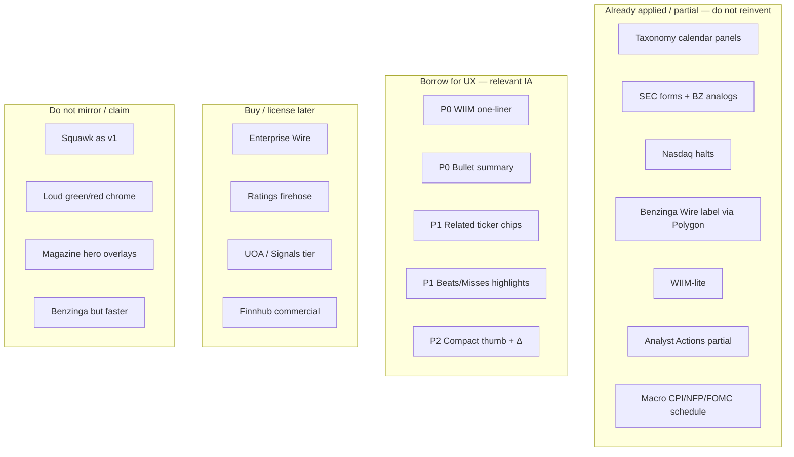

### Feature comparison matrix

| Feature                            | Origin              | CI stance              | Engineer note                        |
| ---------------------------------- | ------------------- | ---------------------- | ------------------------------------ |
| Category / calendar taxonomy       | BZ-inspired         | **Applied**            | Keep category → filter consistency   |
| SEC form → BZ panel analog         | BZ-inspired         | **Applied**            | Read view “BZ panel” analog          |
| Nasdaq halts                       | BZ-inspired         | **Applied**            | Halt/resume pairing                  |
| Wire label via Polygon publisher   | BZ-inspired         | **Applied** when keyed | License: DIY ≠ redistribute          |
| WIIM-lite (`deriveWhyMoving`)      | BZ-inspired         | **Applied (lite)**     | Improve before buying editorial WIIM |
| Analyst Actions (Finnhub)          | BZ-inspired         | **Partial**            | Not Street ratings firehose          |
| Macro schedule (CPI/NFP/FOMC)      | BZ-inspired         | **Applied**            | FRED live = later                    |
| WIIM one-liner above summary       | BZ article IA       | **Borrow P0**          | Fastest triage upgrade               |
| 3–6 bullet takeaways               | BZ article IA       | **Borrow P0**          | Scan behavior                        |
| Related ticker chips               | BZ article IA       | **Borrow P1**          | Needs related-symbol data            |
| Beats/Misses semantic highlights   | BZ article IA       | **Borrow P1**          | Earnings Detail lean                 |
| Compact thumb + Δ                  | BZ article IA       | **Borrow P2**          | No magazine hero                     |
| Enterprise Wire redistribute       | BZ buy              | **Later**              | Paid contract                        |
| Ratings firehose                   | BZ buy              | **Later**              | Paid vendor                          |
| UOA / Signals                      | BZ buy              | **Later**              | Only if Signals tier                 |
| Squawk                             | BZ                  | **Skip**               | TTS ≠ Squawk                         |
| Primary-source proof CTA           | **Catalyst-native** | Core                   | Proof stays secondary CTA in Read    |
| Quiet / playbook filters           | **Catalyst-native** | Core                   | First-class noise reduction          |
| Act / Dismiss loop                 | **Catalyst-native** | Core                   | Decision product, not firehose       |
| Explainable materiality            | **Catalyst-native** | Core                   | “Why this score?”                    |
| Rule order: Source > story > score | **Catalyst-native** | Core                   | Desk principles                      |

**Mirror:** ticker-first hierarchy, causality one-liner, density over imagery, quick open-source actions.  
**Do not mirror:** loud chrome, Squawk v1, multi-panel workspace inside Read, magazine heroes.

---

## 4. Priority matrix (P0 / P1 / P2)

### Session-critical UX (daily use contract) — P0

From Client Target §7.1 / Client Summary §7:

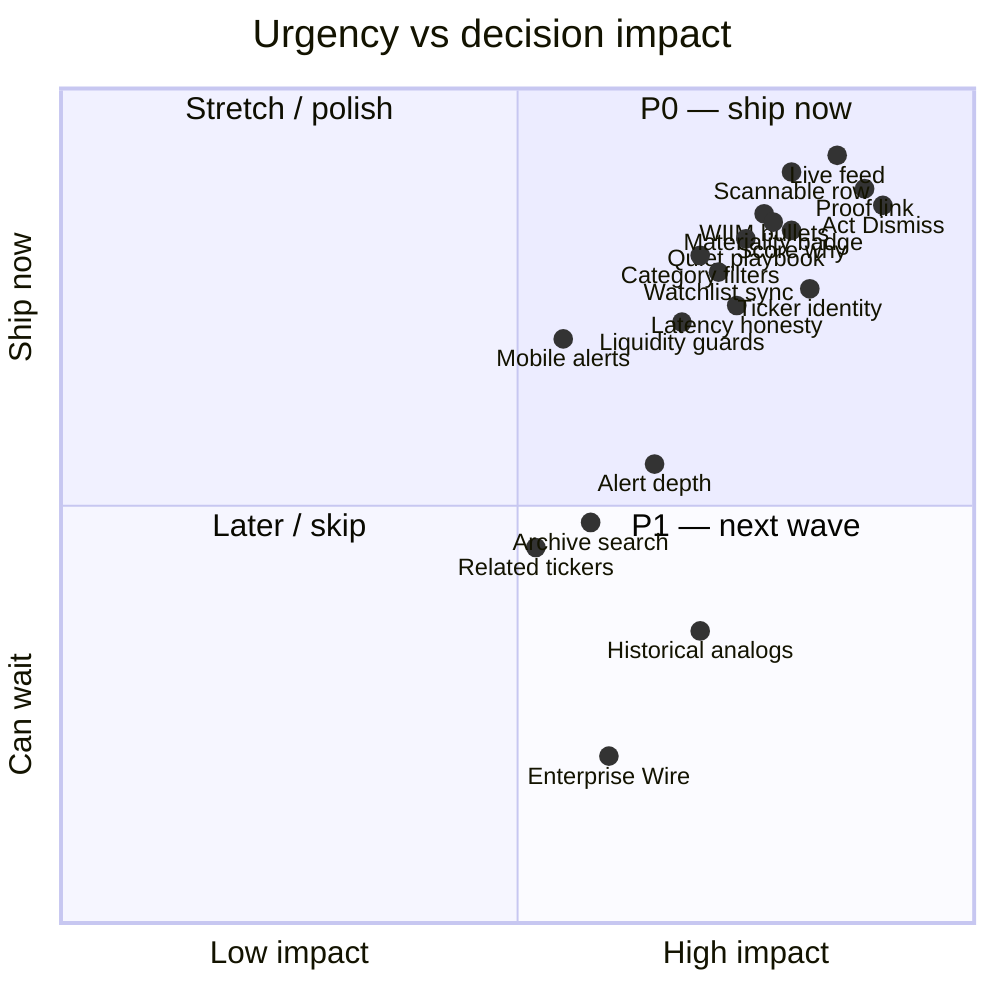

### Checklist by priority

#### P0 — must ship / harden

- [ ] Live catalyst feed (`/dashboard` → `/api/catalysts`)
- [ ] Stable row: **Symbol · Title · Time** (+ Action) — see §1A; Earnings filter uses Date · Name · Symbol · Period · EPS · Estimation
- [ ] Primary-source proof one click (`edgar-proof-link.tsx`)
- [ ] Act / Dismiss (remember dismissals)
- [ ] Materiality badge + plain-language reason
- [ ] Category filters + ticker / time window
- [ ] Watchlist sync + highlight
- [ ] Quiet playbook (`matchesQuietPlaybook`)
- [ ] Reliable ticker / company identity
- [ ] Latency honesty (never fake “instant”)
- [ ] Mobile-usable alert path (desktop primary; push stubbed)
- [ ] Read: WIIM one-liner + bullet summary (Benzinga-Like P0)
- [ ] Always-visible “Why this score?”

#### P1 — decision quality / retention

- [ ] Short grounded summary (3–6 bullets)
- [ ] Lean Bullish/Bearish/Neutral with uncertainty
- [ ] Market context strip (price / % / RVol)
- [ ] Liquidity guards (mcap / price / avg vol)
- [ ] Pre-market emphasis + duplicate suppression
- [ ] Alert prefs: category + min materiality + watchlist-only
- [ ] Act/Dismiss stats
- [ ] Related ticker chips + Beats/Misses
- [ ] Archive / Search
- [ ] Saved playbook presets
- [ ] Graceful failure when source/AI down

#### P2 — later / gated

- [ ] Compact thumb + Δ since publish
- [ ] Historical analogs (real data only — JTBD 5)
- [ ] FDA / Form 4 expansion
- [ ] Enterprise Wire / ratings / UOA (paid)
- [ ] Team SSO / audit / Mobile PWA polish

### Built vs aspirational (label honestly in PRs)

```text
BUILT / IN-PRODUCT                    ASPIRATIONAL (do not overclaim)
─────────────────────────────         ────────────────────────────────
SEC EDGAR + supporting sources        Trusted AI lean as alpha
Live feed + Quiet + watchlist         Rich similar-events outcome DB
Rule-based materiality                Deep personalized alert AI
Alerts (webhook/email; push stub)     Enterprise Wire exclusives
WIIM-lite + internal article          Full BZ calendar UX parity
Auth / dashboard shell                Prop SSO / audit exports
```

**Sources:** Client Target §6, Client Summary §5, Benzinga Source Map Applied checklist.

---

## 5. Suggested first tickets (start tomorrow)

```mermaid
flowchart LR
  T0["0. Dashboard JTBD<br/>Symbol/Title/Time + filters<br/>live-catalyst-feed.tsx"]
  T1["1. Read triage<br/>WIIM + bullets<br/>catalyst-article-view.tsx"]
  T2["2. Score explainability<br/>MaterialityBadge why<br/>drawer + article"]
  T3["3. Symbol panel<br/>chart + quote + related<br/>drawer / split"]  T4["4. Alert prefs depth<br/>alert-rules-panel.tsx"]
  T5["5. Acceptance pass<br/>ACCEPTANCE-JTBD.md<br/>on dev Preview"]

  T0 --> T1 --> T2 --> T3 --> T4 --> T5
```

| #   | Ticket                           | Files / surfaces                            | Source                   |
| --- | -------------------------------- | ------------------------------------------- | ------------------------ |
| 0   | Dashboard JTBD (columns/filters) | `live-catalyst-feed.tsx`, feed-display      | §1A product JTBD         |
| 1   | Read triage upgrade              | `catalyst-article-view.tsx`                 | Benzinga-Like P0         |
| 2   | Score explainability             | drawer + article next to `MaterialityBadge` | Client Target §7.3       |
| 3   | Symbol click panel               | drawer / `tape-split-panel.tsx` + quote API | §1A-C                    |
| 4   | Alert prefs depth                | `alert-rules-panel.tsx`                     | JTBD 4 / Architecture S2 |
| 5   | Acceptance pass on `dev` Preview | `ACCEPTANCE-JTBD.md`                        | Fix before new chrome    |

---

## 6. Out of scope (do not build unless asked)

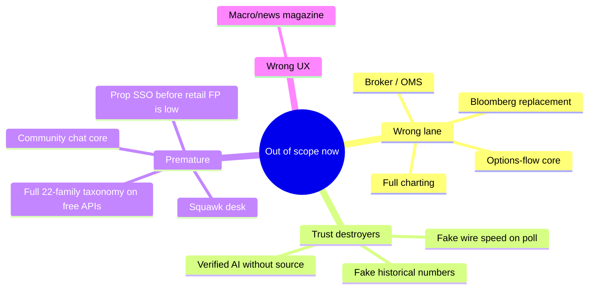

| Out of scope                         | Reason                     |
| ------------------------------------ | -------------------------- |
| Full charting platform               | Wrong lane (Trade Ideas)   |
| Broker / OMS / autotrader            | Legal + focus              |
| Options-flow / UOA as core           | Unusual Whales lane        |
| Macro/news magazine UX               | Firehose churn             |
| Community chat as core               | Not the decision product   |
| Squawk audio desk                    | No public equivalent       |
| Bloomberg / multi-asset terminal     | Wrong buyer                |
| “Real-time wire speed” on cron/poll  | Trust destroyer            |
| Fake historical reaction numbers     | JTBD 5 rule                |
| Full 22-family taxonomy on free APIs | Language ≠ ingest coverage |
| Prop multi-seat SSO early            | Client Target GTM          |

**Sources:** Client Target §7.4, Architecture Later table, Benzinga source map “Suggested only”.

---

## 7. Success signals (at a glance)

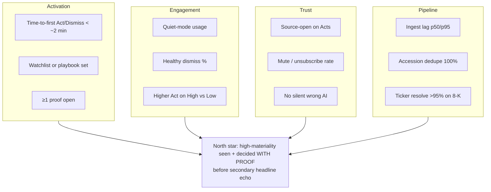

**Sources:** Client Target §9, Client Summary §8, Architecture §9.

---

## 8. Source index

| Doc                                                                                  | Use for                                    |
| ------------------------------------------------------------------------------------ | ------------------------------------------ |
| [`ENGINEER-UX-FEATURE-ROADMAP.md`](./ENGINEER-UX-FEATURE-ROADMAP.md)                 | Full prose companion (this file is visual) |
| `Catalyst-Intel-Client-Target-Guideline.md`                                          | Personas, JTBD, must-haves, non-goals      |
| `Catalyst-Intel-Client-Summary.md`                                                   | Condensed truth + taxonomy + POC order     |
| `Catalyst-Intel-Client-Architecture-and-Flow.md`                                     | IA, backlog, phased roadmap                |
| `Catalyst-Intel-JTBD-UX-UI.md`                                                       | Implemented UI map + component paths       |
| `ACCEPTANCE-JTBD.md` (repo root)                                                     | QA checklist for Preview                   |
| `Catalyst-Intel-JTBD-Visual-Preview-README.md`                                       | Visual language (design-only)              |
| `Catalyst-Intel-Internal-Article-View.md`                                            | In-app Read vs external proof              |
| `Catalyst-Intel-Benzinga-Like-Article-Display.md`                                    | Which BZ article IA to borrow              |
| `Catalyst-Intel-Benzinga-Pro-Catalysts-Source-Map.md`                                | Applied vs paid vs never-claim             |
| `Catalyst-Intel-Sources-and-Schema-Recommendation.md`                                | Schema / source stack                      |
| `Catalyst-Intel-Persona-Data-Architecture-Proposal.md`                               | Persona ↔ data architecture                |
| [`ENGINEER-UX-UI-IMPLEMENTATION-GUIDE.md`](./ENGINEER-UX-UI-IMPLEMENTATION-GUIDE.md) | Build contract; §4 column grammar          |
| [`ENGINEER-UX-UI-GUIDE-SIMPLE.md`](./ENGINEER-UX-UI-GUIDE-SIMPLE.md)                 | Short feed / column rules                  |
| §1A (this file)                                                                      | Clear news catalysts dashboard acceptance  |

---

_Prefer the [prose roadmap](./ENGINEER-UX-FEATURE-ROADMAP.md) for sprint copy-paste detail; prefer this file for onboarding / planning walls. If a detail conflicts with a source research doc, update the synthesis — don’t silently diverge._
